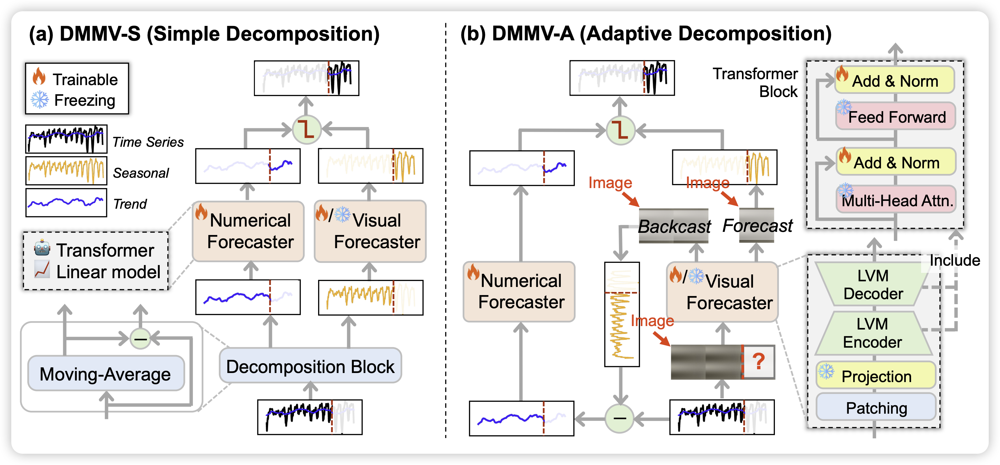
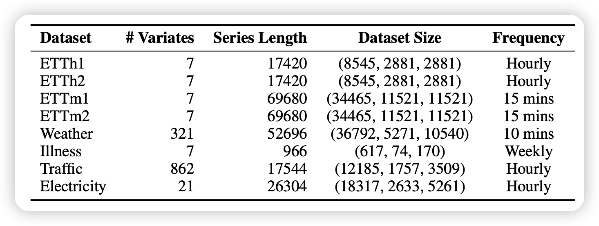
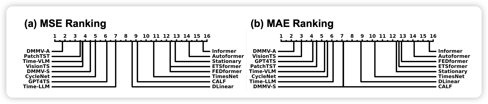
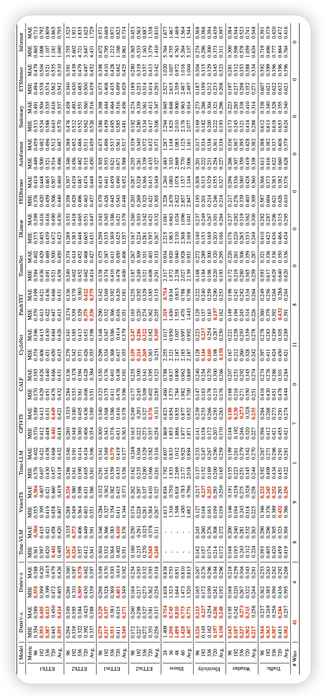

<div align="center">

# (NeurIPS 2025) Multi-Modal View Enhanced Large Vision Models for Long-Term Time Series Forecasting

[](https://arxiv.org/abs/2505.24003)
[](#package)
[](https://opensource.org/license/MIT)
[]()
</div>

<p align="center">
    🔍&nbsp;<a href="#about">About</a>
    | 🚀&nbsp;<a href="#quick-start">Quick Start</a>
    | 📊&nbsp;<a href="#results-and-evaluation">Evaluation</a>
    | 🔗&nbsp;<a href="#citation">Citation</a>
</p>

## 🔍About

This is the official repository for NeurIPS 2025 paper "[Multi-Modal View Enhanced Large Vision Models for Long-Term Time Series Forecasting](https://arxiv.org/abs/2505.24003)". This paper proposes DMMV, a novel decomposition-based multi-modal
view framework that leverages trend-seasonal decomposition and a novel backcastresidual based adaptive decomposition to integrate MMVs for LTSF.

### 🔧Framework

Traditional time series forecasting models often rely on a single representation (e.g., numerical or visual), overlooking the complementary information that can be integrated across different modalities. The Decomposition-based Multi-Modal View (DMMV) framework addresses this limitation by jointly modeling the numerical and visual perspectives of time series within a unified and lightweight architecture.

As illustrated in Figure 1, DMMV consists of two variants, DMMV-S and DMMV-A.
In DMMV-S, a moving-average kernel is applied to decompose the input series into seasonal and trend components. The seasonal part is handled by the Visual Forecaster, while the trend part is modeled by the Numerical Forecaster.

In contrast, DMMV-A not only uses the Visual Forecaster to predict future seasonal sequences but also leverages its inductive bias toward periodicity to perform a backcast operation. This process reconstructs the seasonal component of the original sequence, allowing the residual (trend) part to be extracted and passed to the Numerical Forecaster for prediction.

Both variants share the following core components:
- Visual Forecaster: Utilizes a pre-trained Large Vision Model (LVM) to reconstruct the masked regions of input images, effectively capturing periodic and local patterns.
- Numerical Forecaster: A general series-to-series predictor that models global trends. It can be implemented as a simple linear layer or a Transformer-based numerical forecaster such as PatchTST.
- Fusion Gate: An adaptive gating mechanism that integrates the outputs from both views, balancing trend and periodic information to produce the final forecast.


<div align="center">

|[](./image/model_framework.png)|
|:--:|
|Figure 1: An overview of DMMV framework. (a) DMMV-S uses moving-average to extract trend and seasonal components. (b) DMMV-A uses a backcast-residual decomposition to automatically learn trend and seasonal components.|
</div>


### 🔑 Key Features

- **Multi-Modal Integration**: Jointly models numerical and visual views to capture both trends and seasonal periodic patterns.
- **Decomposition**: Introduces a novel moving-average and adaptive backcast–residual decomposition aligned with LVMs’ inductive bias.
- **Modular Compatibility**: Supports various LVMs (e.g., MAE, SimMIM) and numerical forecasters (e.g., Linear, PatchTST) for flexible deployment.

## 🚀 Quick Start

1. **Clone the Repository**
   ```bash
   git clone https://github.com/D2I-Group/dmmv.git
   cd dmmv
   ```

2. **Set Up the Environment**
   - We recommend using `conda` or `virtualenv` to create an isolated environment.
   ```bash
   python3 -m venv venv
   source venv/bin/activate  # or .\venv\Scripts\activate on Windows
   pip install -r requirements.txt
   ```

3. **Download the datasets**
    - You can obtain the well pre-processed datasets from [Google Drive](https://drive.google.com/drive/folders/1vE0ONyqPlym2JaaAoEe0XNDR8FS_d322) provided by [Time-Series-Library](https://github.com/thuml/Time-Series-Library).
    - Then place the downloaded data in the folder `./dataset`. 
    - Here is a summary of supported datasets.
    <p align="center">
    
    </p>

4. **Run the Code**
    - Make sure the environment, setting is correct.
    - Run `bash scripts/DMMV-A/ETTh1.sh` to start.


## 📊 Evaluation
DMMV is comprehensively evaluated against 14 state-of-the-art (SOTA) models across diverse domains, covering a wide spectrum of time series forecasting architectures, including LLM-, LVM-, VLM-, Transformer-, and CNN-based approaches. Experiments are conducted on eight widely used benchmark datasets, where DMMV achieves the best mean squared error (MSE) on 6 out of 8 datasets.
Figure 2 presents the ranking of DMMV and other baselines in terms of MSE and MAE, further demonstrating the overall superiority of the proposed framework.


<div align="center">

|[](./image/rank.png)|
|:--:|
|Figure 2: Critical difference (CD) diagram on the average rank of all 16 compared methods in terms of (a) MSE and (b) MAE over all benchmark datasets. The lower rank (left of the scale) is better|
</div>

<p align="center">
    
</p>


## 🔗 Citation

```
@inproceedings{shen2025dmmv,
      title={Multi-Modal View Enhanced Large Vision Models for Long-Term Time Series Forecasting}, 
      author={ChengAo Shen and Wenchao Yu and Ziming Zhao and Dongjin Song and Wei Cheng and Haifeng Chen and Jingchao Ni},
      booktitle={NeurIPS},
      year={2025},
}
```

## 📧 Contract

If you have any questions or concerns, please contact us: cshen9 [at] uh [dot] edu or submit an issue
